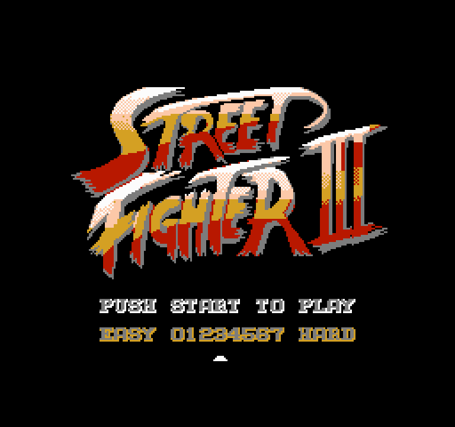
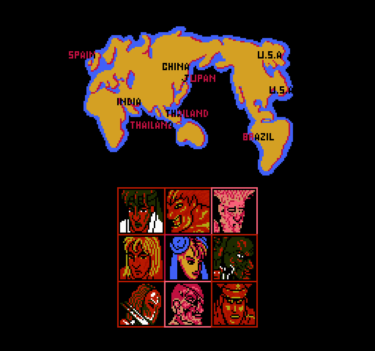
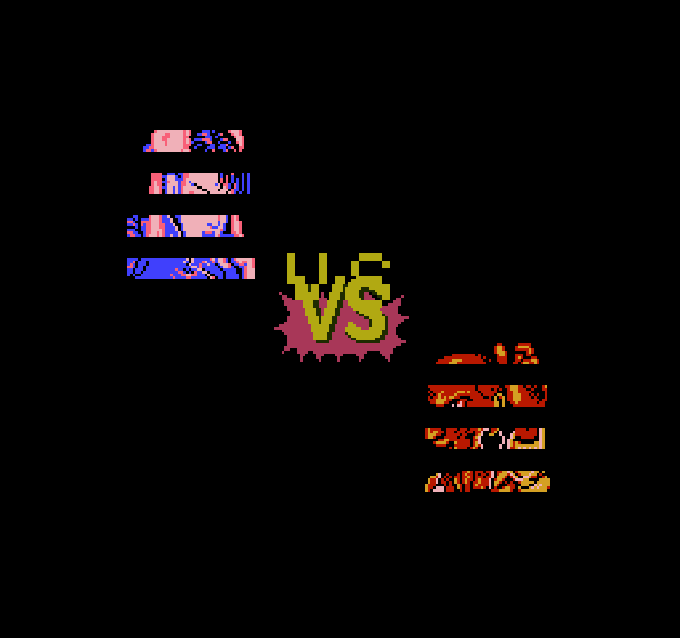
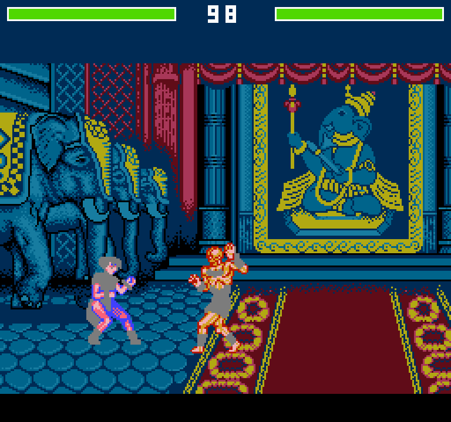
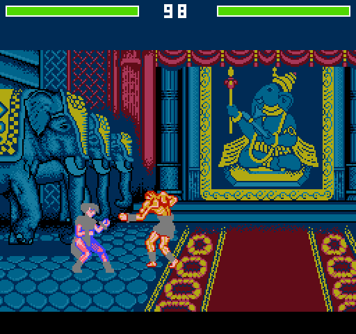
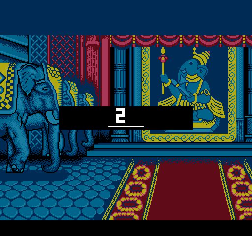

# Street Fighter III (NES) — UEFI Shell 复刻

> 🌐 语言 / Language：**中文** ｜ [English](README_en.md)

把红白机（NES / Famicom）上的格斗游戏 **Street Fighter III (9 Fighter) / Super Fighter III** 的 6502 汇编，**忠实翻译为 C 语言**，以 **UEFI Shell 应用程序** 形式重新实现。图形用 **GOP（Graphics Output Protocol）** 渲染，目标平台 **QEMU + OVMF**，不含声音。

> ⚠️ **版权说明（开源必读）**：本仓库**只**包含原创的重实现 C 源码与构建 / 资源提取脚本。原始游戏 **ROM、反汇编清单及美术资源版权归原权利人所有，未包含在本仓库**。你需要**自行合法取得**该 ROM 的 dump，放置于 `Ref/orgrom.nes`，再运行 `SFC3/resource_extract/` 与根目录的提取脚本，由其生成内嵌的 C 数据表（`*_data.c`、调色板、精灵帧等）。本项目为**教育 / 逆向学习**用途。源代码授权见仓库根的 `LICENSE` 文件（请自行添加，建议 MIT 等 OSI 许可）。

当前版本：**v0.1.0 (build 27)**（开发中，见[路线图](#路线图--todo)）。

## 画面一览

| 标题 | 角色选择 |
|:---:|:---:|
|  |  |

| 对决 VS | 战斗 |
|:---:|:---:|
|  |  |

**动态画面（GIF）**

| 战斗动态（走位 + AI 出招） | 出拳连招 |
|:---:|:---:|
|  |  |

## 这是什么

本工程将一款 NES 格斗游戏的逻辑，从其 6502 反汇编**逐函数翻译**为 C，运行在 UEFI 固件环境里：用 GOP 把模拟的 256×240 PPU 画面整数倍放大并 `Blt` 到屏幕。设计哲学是**忠于原厂逻辑**——状态机、动画帧序列、碰撞、bank 切换等都从反汇编对照翻译，而非凭经验重写；图形资源（CHR 图块、调色板、nametable）从原始 ROM 提取。

## 当前实现状态

- **标题**：logo + “PUSH START TO PLAY / EASY…HARD” + 难度选择光标（可左右移动）。
- **角色选择**：世界地图 + 3×3 头像格。
- **对决 VS**：VS 标 + 双方立绘（立绘已显示；8x16 完整立绘见[路线图](#路线图--todo)）。
- **战斗**：印度神庙竞技场（用**逐扫描线 CHR 分段**还原地板 / 帷幕等多 bank 背景）、双方角色可走位 / 出招（多帧动画）、简化 AI。
- **调色板**：以参考截图采样 + 标准 NES 表混合的复合调色板 LUT，缓解原始 RGB 表过饱和的问题。

> 说明：角色姿态为“可辨认的近似”（精确逐帧姿态、蹲姿偏移、忠实 AI 仍在路线图中）；VS 立绘当前以 8×8 渲染呈分条状，完整还原见路线图。

## 架构 / 模块

NES 硬件被模拟为一组 C 结构（`NES_STATE`：RAM + PPU 寄存器 + Mapper91 bank + 帧缓冲），每帧 `PpuRenderFrame` 生成 256×240 调色板索引帧缓冲，`GopPresent` 经 LUT 转 BGR 并整数缩放 `Blt` 输出。

| 模块 | 职责 |
|---|---|
| [main.c](SFC3/main.c) | 入口、主循环、GOP/输入/计时初始化 |
| [nes_state.c](SFC3/nes_state.c) / [nes_state.h](SFC3/nes_state.h) / [nes_types.h](SFC3/nes_types.h) | NES 状态结构、RAM/PPU/Mapper 映射 |
| [ppu.c](SFC3/ppu.c) | PPU 寄存器、Mapper91、tile 解码、背景+精灵帧渲染、调色板 LUT |
| [gop_render.c](SFC3/gop_render.c) | GOP 缩放 + 双缓冲 `Blt` + 版本号水印 |
| [background.c](SFC3/background.c) / [background_data.c](SFC3/background_data.c) | 画面 nametable / 调色板 / **逐扫描线 CHR 分段表** |
| [game_state.c](SFC3/game_state.c) | 状态机、场景切换、战斗循环、AI 钩子、各场景 NMI 处理 |
| [fighter.c](SFC3/fighter.c) / [fighter_data.c](SFC3/fighter_data.c) | 角色状态机（简化）、碰撞 |
| [fighter_sprite.c](SFC3/fighter_sprite.c) / [fighter_sprite_data.c](SFC3/fighter_sprite_data.c) | **忠实翻译 sub_E4E8 的精灵发射** + VS 立绘渲染 + 烘焙帧/动画表 |
| [ai.c](SFC3/ai.c) | 简化 CPU 对手 |
| [input.c](SFC3/input.c) / [timer.c](SFC3/timer.c) | UEFI 键盘→NES 手柄映射、帧计时 |
| [resource.c](SFC3/resource.c) | 从磁盘加载 CHR / PRG 到内存 |

## 资源提取（从 ROM 生成 C 数据）

内嵌数据表**不手抄**，而由脚本从 `Ref/orgrom.nes` 生成：

- 背景 / nametable：`SFC3/resource_extract/`（`generate_background_data.py`、`decode_*`、`extract_resources.py`）。
- 精灵帧 / 动画：根目录 `extract_fighter_sprites.py` + `gen_fighter_sprite_data.py` + `build_fighter_timelines.py`（解析原厂动画脚本 VM 的操作数，烘焙每帧三元组与时间线）。
- 调色板：`gen_palette_selectsample.py` / `gen_soft_palette.py`（参考采样 + 标准表混合）。

## 构建

**前置**：EDK2（含 `OvmfPkg`，克隆到 `../edk2` 或自行设置 `WORKSPACE`）、Visual Studio 2019、QEMU、NASM、Python 3。

推荐用根目录 [build_direct.ps1](build_direct.ps1)（它会设置 `VS2019_PREFIX`、`NASM_PREFIX` 等易错环境变量，并把产物 `SFC3.efi` 拷到 `qemu_disk/`）：

```powershell
powershell -ExecutionPolicy Bypass -File build_direct.ps1
```

或手动 EDK2 构建（先 `edksetup.bat`）：

```bat
build -p OvmfPkg\OvmfPkgX64.dsc -a X64 -t VS2019 -b DEBUG -m SFC3\SFC3.inf
```

> 脚本内的 EDK2 / VS / QEMU 路径为开发者本机默认值，开源后请按本机路径修改脚本或设置相应环境变量。

## 运行

把 `SFC3.efi` 放进 `qemu_disk/`（含 `startup.nsh`），窗口运行：

```powershell
powershell -ExecutionPolicy Bypass -File run_qemu_window.ps1
```

无头 + QMP（便于自动截图）：`run_qemu_qmp.ps1`。

**操作键位**

| NES | 键盘 |
|---|---|
| 上 / 下 / 左 / 右 | W / S / A / D 或 方向键 |
| A（拳） | K |
| B（重） | J |
| Start | Enter |

## 项目结构

```
SFC3/                  UEFI 应用源码（见“架构”）
SFC3/resource_extract/ 从 ROM 生成 C 数据的脚本
article/               本工程运行截图 / GIF（文档用）
build_direct.ps1       推荐构建脚本
run_qemu_window.ps1    窗口运行
run_qemu_qmp.ps1       无头 + QMP 运行
CLAUDE.md              详细工程规范与原厂映射备忘
Ref/                   （不入库）原始 ROM / 反汇编，需自备
```

## 路线图 / TODO

- **VS 立绘完整化**：原厂以 8x16 精灵 / 或把立绘当背景图块写入 nametable 绘制；当前 8x8 渲染呈分条，需补 8x16 + 双窗 CHR 映射或 nametable 画法。
- **忠实 AI 与姿态**：翻译原厂 `sub_DA24` 决策链、补蹲姿脚本级 dy 偏移、逐角色姿态校验。
- **调色板精修**：进一步对齐参考观感（含角色 sprite 调色板微调）。
- 声音：暂不计划。

## 相关链接

- 详细工程规范与原厂地址映射：[CLAUDE.md](CLAUDE.md)
- 英文文档：[README_en.md](README_en.md)
